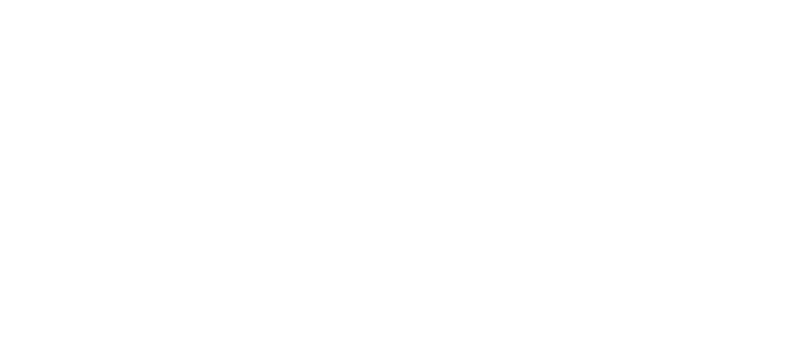

# Anstoss Online Transfer Market App
* Reimplementation of Spring Boot and Quarkus app
* How it works
  * Fetch html from site anstoss-online.de
  * Parse/Extract specific transfer market data
  * Save data in MongoDB
  * Rest interface for advanced searching
* First Go app I ever wrote (in 2022) -> Update needed
* Go app replaced the Quarkus app on my shared hoster

## App Overview

